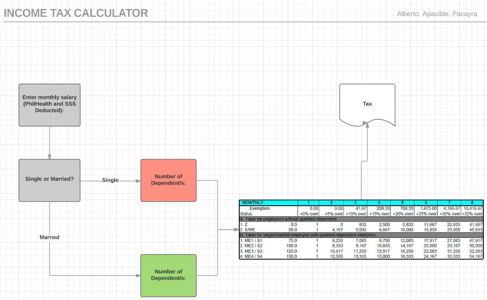

# Project-Proposal Alberto, Apacible, Pacayra

TITLE: INCOME TAX PHILIPPINE SETTING

TOPICS TO BE USED:
1. Structures
2. Pointers
3. Basic I/O
4. Conditional Statements
5. Arrays/Strings

BACKGROUND:
- A program that can calculate the income tax of a person given its status and monthly income in Philippine setting. 

MEMBERS:
1. ALBERTO, BEA S. 
2. APACIBLE, PATRICK ANTHONY M.
3. PACAYRA, APRIL  OILEC  DEANIELLE B.

